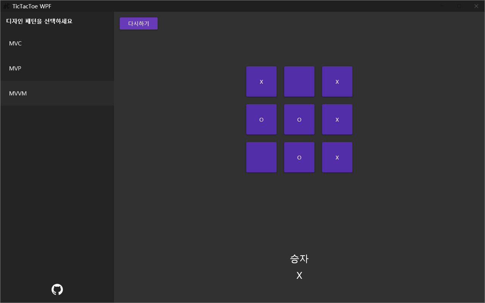

# wpf-TicTacToe-example

Example TicTacToe game project of MVC, MVP, MVVM design patterns.  

This project comes from [Kayuse88/wpf-TicTacToe-example: MVC, MVP, MVVM pattern example (github.com)](https://github.com/Kayuse88/wpf-TicTacToe-example)

Nuget Dependancy

FluentWPF  
MaterialDesignInXaml
